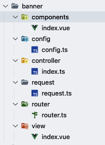

# vue-controller

> 本插件是基于vsCode创建vue 项目的插件 ，模拟 `Laravel` 的 一键创建：控制器、模型、视图、路由、配置文件等操作

## 插件安装
1. 搜索 `vue-controller`
2. 点击 `install`

## 插件右键展示


## 插件使用
### ❤️New vue controller
> 创建控制器、模型、视图、路由、配置文件等



### 🌍 Copy Vue Router
> 一键复制文件夹下所有路由
```js
import { adRoutes } from "../views/ad/router/router"
import { bannerRoutes } from "../views/banner/router/router"
import { indexRoutes } from "../views/index/router/router"
```

### 树形结构
+ views（目录名）
  + view
    + index.vue   视图文件
  + components
    + index.vue 组件文件
  + controller
    + index.ts	控制器文件
  + request
    + request.ts	请求文件
  + router
    + router.ts	路由文件
  + config
    + config.ts	配置文件


### 新增功能 
#### 一键复制routers
```js
import { adRoutes } from "../views/ad/router/router"
import { bannerRoutes } from "../views/banner/router/router"
import { indexRoutes } from "../views/index/router/router"

const routes = [
      ...adRoutes,
      ...bannerRoutes,
      ...indexRoutes,
      {
            path: "/",
            redirect: "/index",
      },
]
```